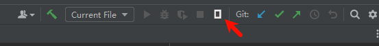

# OpenCode Connector

IntelliJ IDEA 插件，用于快速将选中的代码发送到 OpenCode，并支持一键启动 OpenCode。

## 功能特性

- **快捷键发送代码**：通过快捷键将选中代码发送到 OpenCode
- **右键菜单发送**：通过编辑器右键菜单发送代码
- **一键启动 OpenCode**：工具栏按钮自动在 Terminal 中启动 OpenCode
- **自动端口检测**：自动查找可用端口（20000-40000）
- **多实例支持**：支持同时运行多个 OpenCode 实例

## 安装

1. 下载最新的插件安装包（`.zip` 文件）
2. 打开 IntelliJ IDEA
3. 进入 `Settings/Preferences` → `Plugins` → `⚙️` → `Install Plugin from Disk...`
4. 选择下载的 `.zip` 文件
5. 重启 IDE

## 使用方法

### 启动 OpenCode

点击主工具栏的执行图标



new ui

- 自动查找可用端口
- 在 Terminal 中执行 `opencode --port <port>`
- 激活 Terminal 窗口

### 发送代码到 OpenCode
1. 在编辑器中选中代码
2. 使用以下任一方式发送：
   - **快捷键**：
     - Windows/Linux: `Ctrl+Alt+K`
     - macOS: `Cmd+Option+K`
   - **右键菜单**：选择 `Send to OpenCode`

发送的代码格式为：`@文件路径#L起始行-结束行`

## 开发构建

### 环境要求

- JDK 17+
- Gradle 8.0+

### 构建命令

```bash
# 构建插件
./gradlew buildPlugin

# 运行插件（沙箱环境）
./gradlew runIde

# 运行测试
./gradlew test
```

构建产物位于：`build/distributions/opencode-connector-*.zip`

## 技术栈

- Java 17
- IntelliJ Platform SDK 2023.2
- Gradle (Kotlin DSL)
- Gson 2.10.1

## 许可证

MIT License

